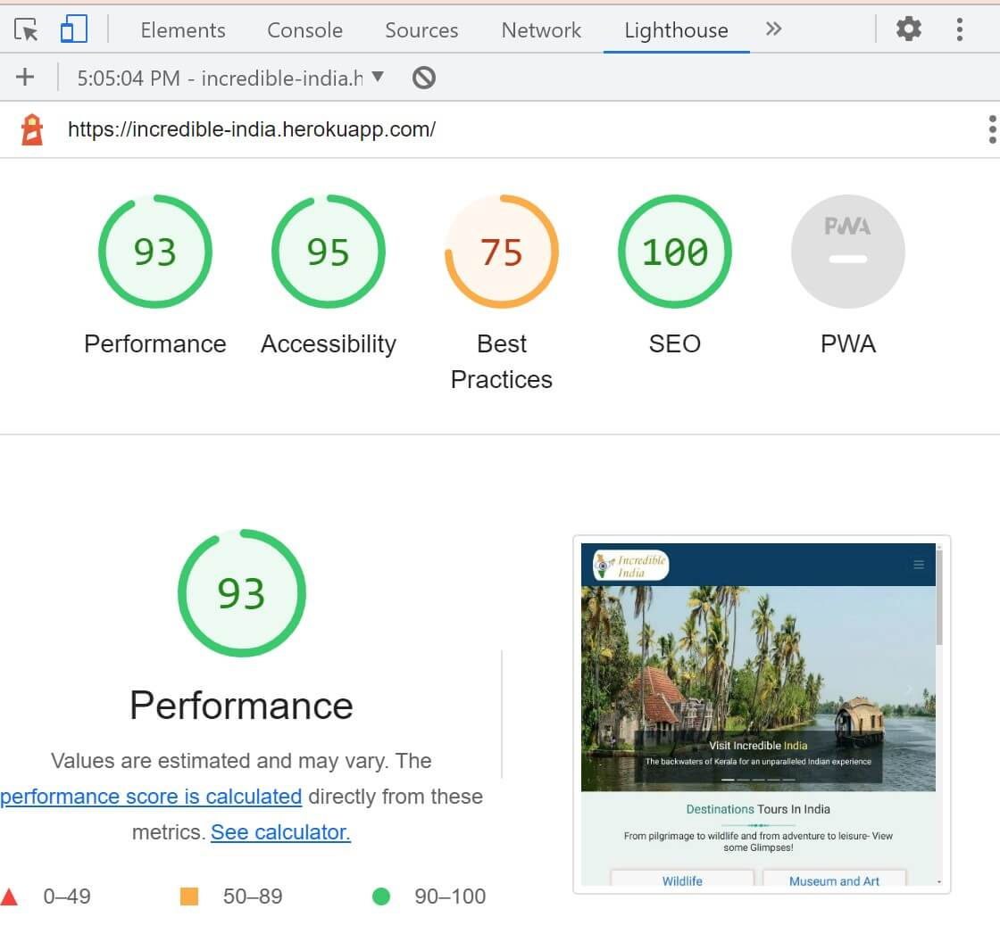
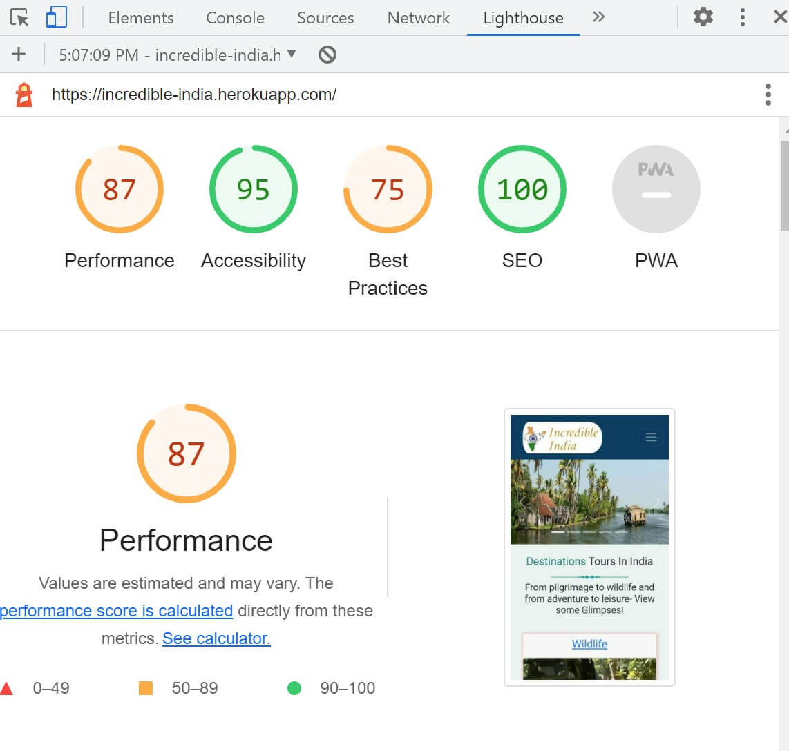
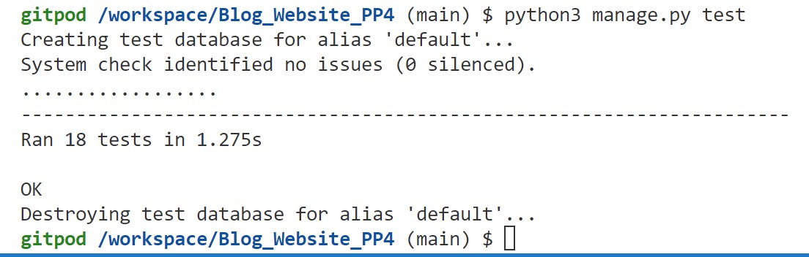

# Incredible India - Testing

:arrow_left: [Return to the README](README.md)

## Table of Contents
- [Performance](#performance)
  - [Google's Lighthouse Performance](#googles-lighthouse-performance)
- [Code Validation](#code-validation)
  - [HTML Validation](#html-validation)
  - [CSS Validation](#css-validation)
  - [PEP8 Validation](#pep8-validation)
- [Testing](#testing)
  - [Manual Testing (BDD)](#manual-testing-bdd)
  - [Automated Testing](#automated-testing)
  - [Features Testing](#features-testing)

## Performance

### Google's Lighthouse Performance

[Google Lighthouse](https://developers.google.com/web/tools/lighthouse) was used to test the performance of the website. 
#### Desktop Results:
.

#### Mobile Results:
.

*Go back to the [top](#table-of-contents)*

## Code Validation

### HTML Validation
The [W3C Markup Validation Service](https://validator.w3.org/) was used to validate the HTML of the website.
All the Django templates html files hava been manually copying the source of the rendered pages and then validating using the W3C Validator.
 - Result for [home page](./assets/testing/W3C-home-page.jpg)
 - Result for [about page](./assets/testing/W3C-about-page.jpg)
 - Result for [blog page](./assets/testing/W3C-blog-page.jpg)
 - Result for [post-detail page](./assets/testing/W3C-post-detail.jpg)
 - Result for [user page](./assets/testing/W3C-user-page.jpg)
 - Result for [add-post page](./assets/testing/W3C-add-post.jpg)
 - Result for [update post](./assets/testing/W3C-update-post.jpg)
 - Result for [delete post](./assets/testing/W3C-delete-post.jpg)
 - Result for [edit comment](./assets/testing/W3C-edit-comment.jpg)
 - Result for [search page](./assets/testing/W3C-search-page.jpg)

### CSS Validation 
[Jigsaw CSS validator](https://jigsaw.w3.org/css-validator/) was used for validating the CSS stylesheet. CSS file was tested by manually copying the CSS codes into the manual input option.

- The result can be seen [here](assets/testing/css-validator.jpg).

### PEP8 Python Linter Test
- [PEP8 CI Python Linter](https://pep8ci.herokuapp.com/) was used to check that the Python code meets PEP8 standards.

### Blog
* [admin.py](./assets/testing/pep8-admin-py.jpg)
* [models.py](./assets/testing/pep8-models-py.jpg)
* [forms.py](./assets/testing/pep8-forms-py.jpg)
* [urls.py](./assets/testing/pep8-urls-py.jpg)
* [views.py](./assets/testing/pep8-views-py.jpg)

## Manual Testing (BDD)

BDD, or Behaviour Driven Development, is the process used to test user stories in a non-technical way, allowing anyone to test the features of an app.

User Story | BDD Test | Pass
--- | --- | :---:
As a first time site user  I can easily see the purpose of the site from the landing page  so that I can see if the site is relevant to my needs. | Given that I'm a first time user When I view/scroll down the homepage Then I should see what the purpose of the site is and easy navigation throughout the website. | :white_check_mark:
As a first time site user  I can view a paginated list of posts so that easily select a post to view.|Given that I'm a first time user When I view the blog page Then I view a list of blog posts. | :white_check_mark:
As a site user  I can view a list of post specific to a certain destination place  so that I can view most relevent post I am searching for. | Given that I'm a site user  When I click on destination dropdown Then I should select any destination and view all posts within that destination. |:white_check_mark:
As a site user   I can view the number of likes and comments on each post  so that I can see which one is the most popular or viral and read the conversation on an individual post. | Given that I'm a site user When I view the post detail page Then I view the number of likes and list of comments on that post. | :white_check_mark:
As a site user  I can register an account  so that I can comment and like on a post. | Given that I'm a site user When I register an account on homepage Then I can access the main functionality of the site. | :white_check_mark:
As a registered user I want to be able to easily login/log out So that I can access my information without registering every time and ensure the security of my account. | Given that I'm a site user When I login/log out Then I can access my information without registering every time and ensure the security of my account. |:white_check_mark:
As a logged in user  I can like/unlike and leave a comment on a post  so that I can be involved in the conversation. | Given that I'm a logged in user When I am on post detail page Then I can like/unlike and leave a comment on the post. |:white_check_mark:
As a site user I can use a search bar to search for a specific place  so that I have quick and easy access to the information I need. | Given that I'm a site user When I use the search bar Then I should see specific post/s that match my search query. |:white_check_mark:
As a site user I want to be able to receive a feedback for my action  so that I know my inputs are working. | Given that I'm a site user When I register,login/logout, access CURD functionality for a post Then I should receive a confirmation message.| :white_check_mark:
As an author  I can access all my posts easily in one place  so that I can easily track my activity on the site. |Given that I'm a author of post When I am logged in and navigate to user-page Then I can view all of mine posted blog post.| :white_check_mark:
As an author/user I can fully access the CURD functionality   so that I can manage my blog content. | Given that I'm an author/user When I am logged in and navigate to user-page  Then I need to be able to CURD mine post content on the website.| :white_check_mark:
As a site admin I want to be able to review all posts, destinations, users, comments, etc  So that I can maintain the site and remove any offensive content. | Given that I'm a site admin When I navigate to the admin panel Then I should see all posts, destination, comments, likes, etc. | :white_check_mark:
As a site admin  I can approve or disapprove comments so that I can filter out objectionable comments.| Given that I'm a site admin When I navigate to the comment model in admin panel Then I need to be able to approve or disapprove any comments.| :white_check_mark:
As a site admin I want to be able to create/edit/update/delete a post  	so that I can maintain the site and remove any offensive content. | Given that I'm a site admin When I navigate to the admin panel Then I need to be able to control all the content on the website.| :white_check_mark:
As a site admin I want to be able to direct users to my social profiles  So that I can increase social interaction and attract new users. | Given that I'm a site admin When I view/scroll down to the footer Then I should see working links to my social media. | :white_check_mark:
As a site admin I want to be able to ensure that all areas of the site to function correctly and have no bugs  so that I can ensure an enjoyable browsing experience for all users. | Given that I'm a site admin When I check all site functionality Then I should see that everything works as expected, there are no bugs and all links and forms work as expected | :white_check_mark:

## Automated Testing

I have performed some basic automated tests on the forms, urls and models. The tests passed as shown below.

.

## Features Testing

In addition to the other tests, I have conducted a manual check list for different features of website to make sure that everything is working as intended.

| Status | **Navigation Bar - User Logged Out**
|:-------:|:--------|
| &check; | Clicking the navbar logo loads the home page
| &check; | Navbar shows the nav links for Home, About, Blog, Register, Login, Destination and search field, search button if the user is logged out
| &check; | Clicking the Home tab on the navbar loads the home page
| &check; | Clicking the About tab on the navbar loads the about page
| &check; | Clicking the Blog tab on the navbar loads the blog page
| &check; | Clicking the Login tab on the navbar loads the login Page
| &check; | Clicking the Register tab on the navbar loads the register page
| &check; | Clicking the Destination tab on the navbar loads the destination page
| &check; | Clicking the Search button on the navbar loads the search page

| Status | **Navigation Bar - User Logged In**
|:-------:|:--------|
| &check; | Clicking on navbar logo, Home, About, Blog, Destination, Search loads the relevant page as described above for user logged out
| &check; | Navbar shows the tabs Home, About, Blog, Logout, UserName(for example: Mahi), Destination and search field, search button if the user is logged in
| &check; | The navbar shows the username of the logged in user and clicking on that username tab loads the user page
| &check; | Clicking the Logout tab on the navbar loads the logout page

| Status | **Footer - User Logged Out/In**
|:-------:|:--------|
| &check; | Clicking the heading 'Incredible India' loads the home page
| &check; | Clicking the LinkedIn/icon loads the my LinkedIn in a new tab
| &check; | Clicking the Github/icon loads the my GitHub in a new tab

| Status | **Destination Dropdown**
|:-------:|:--------|
| &check; | Clicking on the Destination tab shows a dropdown list which further shows the selected destination post

| Status | **Home Page**
|:-------:|:--------|
| &check; | User can see the carousel images on first view
| &check; | The Destination section navigates to the blog post of the selected destination type

| Status | **Blog Page**
|:-------:|:--------|
| &check; | Shows the blog posts paginated by 9 posts and the prev/next button works as expected
| &check; | Clicking on the post image and title loads the post detail page.

| Status | **Post Detail Page**
|:-------:|:--------|
| &check; | Shows the full content of the post
| &check; | Shows a list of comments posted so far, if any
| &check; | Comment box is visible with Sign Up and Sign In link 

| Status | **Post Detail Page - User logged in**
|:-------:|:--------|
| &check; | Shows the full content of the post
| &check; | Like icon works only when the user is logged in
| &check; | Shows a list of comments posted so far, if any 
| &check; | Comment box is visible with comment body and submit button 
| &check; | Submitted comment displays in comment list
| &check; | User can edit/delete his own comment

| Status | **Edit comment - User logged in**
|:-------:|:--------|
| &check; | That the user can see the comment body input field is already prepoulated with the content as it currently is
| &check; | Clicking Update button, updates the comment content
| &check; | That an alert message informs the user that their comment has been updated successfully

| Status | **Delete Comment - User Logged In**
|:-------:|:--------|
| &check; | That the user can see a modal to make sure to delete the comment
| &check; | Clicking the Close button fade the modal
| &check; | Clicking the Delete button inform the user that the comment deleted successfully

| Status | **Add a Post - User Logged In**
|:-------:|:--------|
| &check; | That the Title input field is required
| &check; | That the Content field is required
| &check; | That the Best Time field is required
| &check; | That the Ideal Duration field is required
| &check; | That the form cannot be submitted without all the required fields and user feedback is given if a user forgets a required field
| &check; | That when the form is submitted a post slug is automatically created from the title and post author input fields in the form
| &check; | That when the post is added, the user is redirected back to the 'User page and a message alert informs the user that they successfully added a post

| Status | **Edit Post - User Logged In**
|:-------:|:--------|
| &check; | That the user can see the post input field is already prepoulated with the content as it currently is
| &check; | Clicking Update button, updates the post content
| &check; | That an alert message informs the user that their post has been updated successfully

| Status | **Delete Post - User Logged In**
|:-------:|:--------|
| &check; | That the user can see the user name and the message with post title that they would like to delete their post
| &check; | Clicking the Delete button redirects back to the User page
| &check; | That an alert message informs the user that they successfully deleted their post
| &check; | That the post is completely deleted and doesnt show up in the database or subsequently any place on the website

